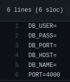

<h1>Zappers</h1>

<h2>Intoduction</h2>

Welcome to zappers project, here I build the database and api for the zappers app.

<h2>Here is a link to the project running in vercel:</h2>

https://zappers-front.vercel.app/

Unfortunately, heroku isn't working anymore, so the deploy of the backend crashed

<h2>More in depth of the project</h2>

The BackEnd part was pretty simple, it just save login and the massages that you send.

<h2>technologies I used:</h2>

<h2>How to run the project:</h2>

First, you need to clone the repo to your machine

    git clone https://github.com/MarcioVCunha/zappers-back

Then, you will have to create a databse using postgres, there is a dump file, so it should be pretty easy.

Now, you have to create a .env.test archive with your database informations, following the .env.example.

Finally, go to the front (link [here](https://github.com/MarcioVCunha/zappers-front)) and set it up.

Just type the command to install the dependencies
  
    npm i
    
And run the server with

    npm start

in the root of the back.
